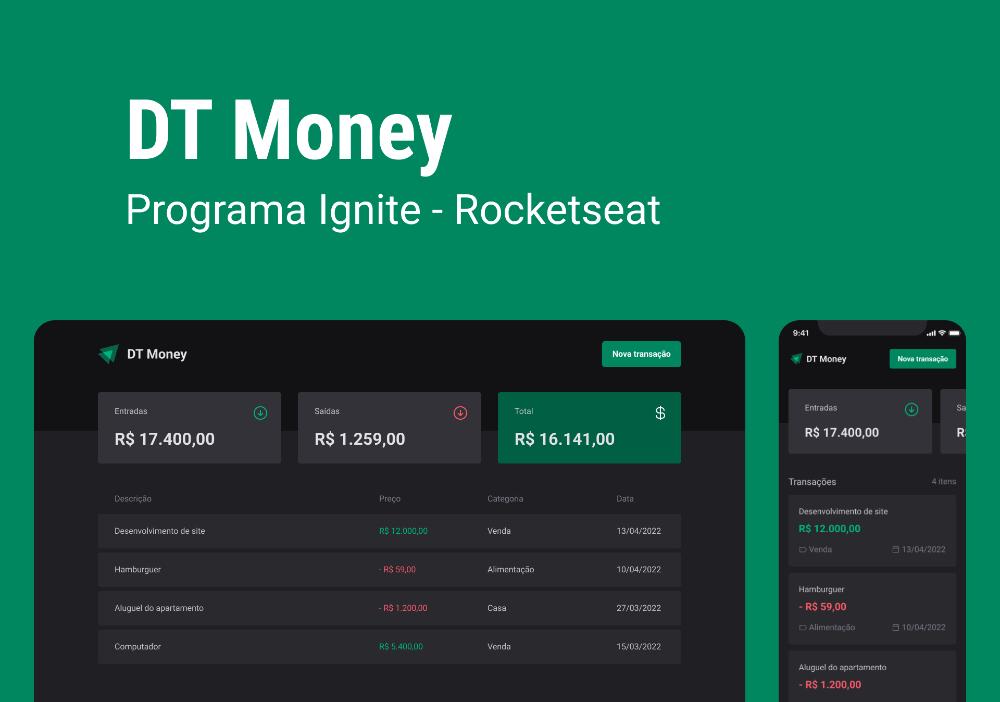

<div align="center">
  
</div>

<p align="center" style="margin-top: 20px;">
  
  <a href="LICENSE"></a>
</p>

## 🚀 Sobre o Projeto
DT Money é um controle de contas financeiro pessoal que cadastra contas de entrada e saída, totaliza em cards utilizando o local storage utilizando o formato JSON para fazer os cadastros.

## 🖼️ Imagens do Projeto
<div align="center">
  
</div>

## 🧰 Tecnologias e Bibliotecas

* [ReactJS](https://pt-br.reactjs.org/tutorial/tutorial.html)
* [ViteJs](https://vitejs.dev/)
* [Tailwindcss](https://tailwindcss.com/)
* [RadixUi](https://www.radix-ui.com/)
* [TypeScript](https://www.typescriptlang.org/)

## ⚙️ Rodando o Projeto
```bash
# Clone este repositório para a pasta anterior
$ git clone https://github.com/samsepi0ldev/dt-money.git
# ou use a opção de download.

# Acesse a pasta dtmoney
$ cd dt-money

# Instale as dependências
$ yarn install
ou
$ npm install

# Executando o Projeto
$ yarn dev 
ou
$ npm run dev
```

## 🔖 Layout
​
Você pode visualizar o layout do projeto através do link abaixo:
[Layout](https://www.figma.com/file/KbfSf1dqBvCXjSicvETnnz/DT-Money-(Community))

Lembrando que você precisa ter uma conta no [Figma](http://figma.com/).

## 📝 License
Esse projeto está sob a licença MIT. Veja o arquivo [LICENSE](LICENSE) para mais detalhes.

---